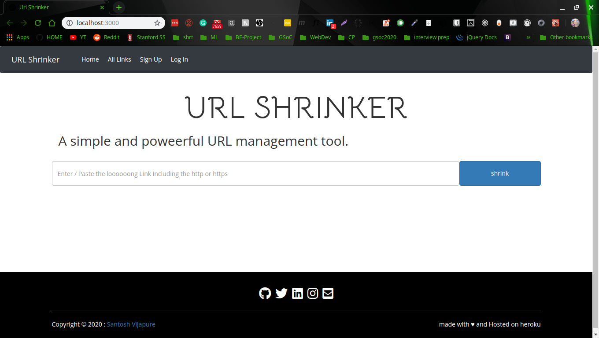

# url-shrinker [react-app](https://shrinker-client.herokuapp.com/) || [API](https://shrinkapi.herokuapp.com)

### simple and powerful link management tool



## Getting started

Install Server dependencies  

```
npm install
```
run the backend (shrinker APIs)
```
node server.js
```
now you can acces all the RESTful APIs 

## getting started with the react(client) app

install all the dependencies
```
npm install
```
run the client app
```
npm start
```

## file structure of server
```
├── app.json
├── client(react)
|     ...
|     ...
├── config
│   └── config.js
├── LICENSE
├── models
│   └── shortUrl.js
├── package.json
├── package-lock.json
├── Procfile
├── README.md
├── routes
│   ├── shrink.js
│   └── utility.js
├── server.js
└── views
    └── index.ejs

```
## file Structure of cliend
```
├── package.json
├── package-lock.json
├── public
│   ├── favicon.ico
│   ├── index.html
│   ├── logo192.png
│   ├── logo512.png
│   ├── manifest.json
│   ├── robots.txt
│   └── url_logo.png
├── README.md
├── server
│   └── server.js
└── src
    ├── App.css
    ├── App.js
    ├── App.test.js
    ├── components
    │   ├── footer.js
    │   ├── NavbarClass.js
    │   ├── ShrinkForm.js
    │   └── TableData.js
    ├── copy.png
    ├── index.css
    ├── index.js
    ├── logo.svg
    ├── serviceWorker.js
    ├── setupTests.js
    └── url_logo.png

```
## API endpoints
```
Method |Path         | description                                   
GET    |/            |- root route
GET    |/all         |-to get the all URL in data
GET    |/one/:id     |-get the data ofone URL
GET    |/:id         |- redirect ot the long URL from short hash
POST   |/srhink      |-create a short URL from loong url
DELETE | /remove/:id |-remove the URL data with hash
```

